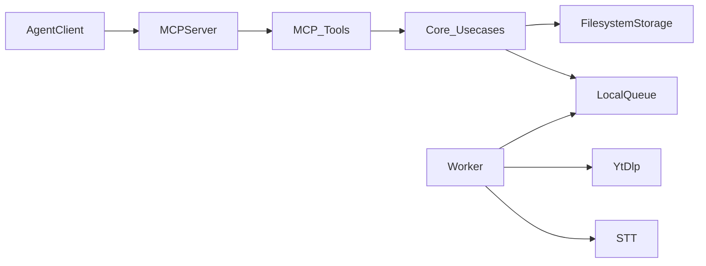

1. The agent calls MCP tools.
2. `apps/mcp-server` validates input and `@scriptiz/mcp-tools` runs use cases.
3. When extraction is needed, a job is enqueued in the local queue (`packages/queue-local`).
4. `apps/worker` claims jobs, uses `extractor-ytdlp` for metadata/captions, and `stt-openai` (or similar) for transcription when required.
5. Results are written under `DATA_DIR` via `storage-filesystem`.
6. MCP UI tools read stored payloads and return JSON for video, list, and job views.

## All-in-one image (`npx @scriptiz/mcp`)

The recommended end-user path runs **one container** (see `docker/Dockerfile.mcp-all-in-one` in the repo) where:

- The **worker** runs in the **background** (same `DATA_DIR` as the MCP process).
- The **MCP server** runs in the **foreground** with **stdio** transport.
- `yt-dlp` and `ffmpeg` are available inside the image; no host install is required.

The npm package `@scriptiz/mcp` is a **thin launcher** that runs `docker run -i` with a volume for `/app/data` and forwards a fixed set of environment variables into the container.

## `DATA_DIR`

- If the **`DATA_DIR`** env var is set, that absolute path is used; otherwise the default is **`~/.scriptiz`** (see `defaultScriptizDataDir` in `packages/core`).
- The Compose example mounts `/app/data`. When attaching MCP from the **host**, set `DATA_DIR` to the **same path** the worker uses.

## Stdio vs health-only (Docker)

- In the **all-in-one** image, the MCP server is started with **stdio** so your IDE can attach a client over stdio.
- In **Compose** `mcp-server` service, `SCRIPTIZ_MCP_START_STDIO=0` turns off stdio and only `HEALTH_CHECK_PORT` serves HTTP health — useful for smoke tests, not for an MCP client session inside that container.
- If you are **not** using the all-in-one image, use MCP on the **host** (`node apps/mcp-server/dist/index.js`) with the same `DATA_DIR` as the worker, or bind-mount a shared data path.

## Worker

- See [Environment](/environment) for `WORKER_POLL_INTERVAL_MS`, `WORKER_STALE_JOB_AFTER_MS`, etc.
- `STT_*` and API keys only need to be set on the **worker** (the MCP server does not call STT APIs directly).
